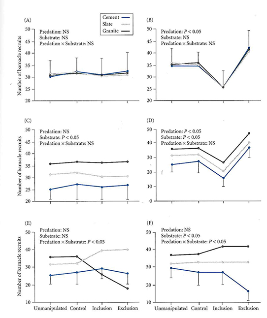
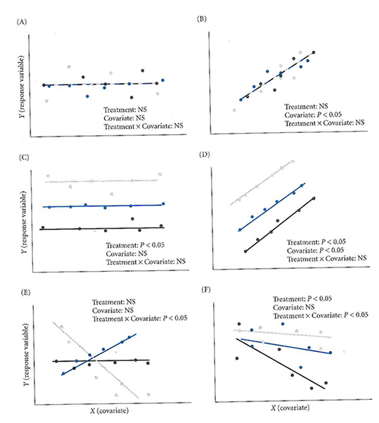

## Degrees of Freedom

<iframe width="560" height="315" src="https://www.youtube.com/embed/N20rl2llHno" frameborder="0" allow="accelerometer; autoplay; clipboard-write; encrypted-media; gyroscope; picture-in-picture" allowfullscreen></iframe>

## ANOVA & ANCOVA


## Basic Goal of ANOVA {.build}


Compare the means of groups that have been sampled randomly, to test whether or not they differ.

The different levels of the categorical variable representing different groups are called **treatments**.

Each observation is called a **replicate** and is assumed to be independent from all other replicates.

So how do we compare group means?  

<div class="red">**Confusingly, it's all about variances (hence ANOVA).**</div>

## Intuitive Picture of ANOVA


```{r echo=FALSE, warnings=FALSE, message=FALSE, fig.width=9, fig.height=3}
set.seed(1234)
library(ggplot2)
theme_set(theme_bw(15))
x <- rnorm(1000, mean=50, sd=2)
y <- rnorm(1000, mean=44, sd=2)
dat <- data.frame(x,y)
library(reshape2)
library(gridExtra)
meltdat <- melt(dat)
diff <- ggplot() + 
  geom_histogram(aes(x=value, fill=variable), position="dodge", data=meltdat) + 
  annotate(geom = "segment", x=mean(meltdat$value) - (var(meltdat$value)/2), xend=mean(meltdat$value) + (var(meltdat$value)/2), y=150, yend=150, size=2) + 
  annotate(geom = "segment", x=mean(dat$x) - (var(dat$x)/2), xend=mean(dat$x) + (var(dat$x)/2), y=142, yend=142,size=2, color="#f35e5a") + 
  annotate(geom = "segment", x=mean(dat$y) - (var(dat$y)/2), xend=mean(dat$y) + (var(dat$y)/2), y=142, yend=142,size=2, color="#17b3b7") + 
  guides(fill=FALSE)

x <- rnorm(1000, mean=50, sd=2)
y <- rnorm(1000, mean=50, sd=2)
dat <- data.frame(x,y)
meltdat <- melt(dat)
similar <- ggplot() + 
  geom_histogram(aes(x=value, fill=variable), position="dodge", data=meltdat) + 
  annotate(geom = "segment", x=mean(meltdat$value) - (var(meltdat$value)/2), xend=mean(meltdat$value) + (var(meltdat$value)/2), y=150, yend=150,size=2) + 
  annotate(geom = "segment", x=mean(dat$x) - (var(dat$x)/2), xend=mean(dat$x) + (var(dat$x)/2), y=145, yend=145, size=2, color="#f35e5a") + 
  annotate(geom = "segment", x=mean(dat$y) - (var(dat$y)/2), xend=mean(dat$y) + (var(dat$y)/2), y=141, yend=141,size=2, color="#17b3b7") + 
  guides(fill=FALSE)

gridExtra::grid.arrange(diff, similar, nrow=1)
```

Colored bars at top represent variances within groups.

Black bars at top represent variances ignoring groups.

## The ANOVA linear model {.build}

$$Y_{ij}=\mu + A_i + \epsilon_{ij}$$

$\mu$ is the population grand mean ($\bar{Y_{ij}}$ an unbiased estimator of $\mu$)

$A_i$ is the additive linear effect compared to the grand mean for a given treatment $i$ ($A_i$‘s sum to 0). 

$\epsilon_{ij}$ is the error variance (the variance of individual points around their treatment group means. These are assumed to be distributed as $N(0,\sigma^2)$).

## ANOVA linear model - Simulation {.build}


$$Y_{ij}=\mu + A_i + \epsilon_{ij}$$

Let's see how changing model parameters affects the y variable.  We will start a few variables that will be kept constant. 

```{r}
grandMean <- 10
groups <- rep(c("A", "B"), 100)
myError <- rnorm(200, mean = 0, sd=3)
```

## ANOVA linear model - Simulation 


```{r}
y <- grandMean + c(-5, 5) + myError
qplot(groups, y, geom="boxplot", fill=groups)
```

## ANOVA linear model - Simulation 


```{r}
y <- grandMean + c(-0.3, 0.3) + myError
qplot(groups, y, geom="boxplot", fill=groups)
```

## The steps in a one-way ANOVA {.build}

> 1.  Calculate the Total SS
> 2.  Calculate the Within-group SS
> 3.  Calculate the Between-group SS
> 4.  Calculate Mean Squares using appropriate df.
> 5.  Calculate the F ratio 
> 6.  Calculate the p-value

<div class="red">
As you could tell from your reading, calculating the appropriate sum of squares is complicated, and depends on your experimental design.  Be careful (or just use Monte Carlo)!
</div>

## Walking through the ANOVA {.build}

Example data from Gotelli Table 10.1

```{r echo=FALSE}
flowers <- data.frame(unmanipulated = c(10,12,12,13), control=c(9,11,11,12), treatment=c(12,13,15,16))
flowers
```

These data represent 12 experimental plots to see the effect of soil temperature on the flowering period in larkspur flowers.  The treatment plots had heating coils installed and activated.  The control plot had heating coils installed but never turned on.  The unmanipulated plots were untouched. 

We want to know if there is a difference in mean flowering length between these groups. 

## We are going to walk through the calculation of ANOVA on the whiteboard

<iframe src="https://giphy.com/embed/3o752krFvxxGVFTq7K" width="400" height="225" frameBorder="0" class="giphy-embed" allowFullScreen></iframe><p><a href="https://giphy.com/gifs/IMDb-tv-show-3o752krFvxxGVFTq7K">via GIPHY</a></p>

## Walking through the ANOVA 

Source | degrees freedom | SS | Mean Square (MS) | Expected Mean Square | F-ratio
----|----|----|----|----|----|----
Among groups|a-1|$\sum\limits_{i=1}^a\sum\limits_{j=1}^n(\bar{Y}_i - \bar{Y})^2$|$\frac{SS_{among_groups}}{(a-1)}$|$\sigma^2 + n\sigma^2_A$|$\frac{MS_{among}}{MS_{within}}$
within groups (residual) |a(n-1)|$\sum\limits_{i=1}^a\sum\limits_{j=1}^n(Y_{ij} - \bar{Y}_i)^2$|$\frac{SS_{within}}{a(n-1)}$|$\sigma^2$
Total|an-1|$\sum\limits_{i=1}^a\sum\limits_{j=1}^n(Y_{ij} - \bar{Y})^2$|$\frac{SS_{total}}{(an-1)}$|$\sigma^2_Y$

## Assumptions of ANOVA {.build}


> 1.  The samples are independent and identically distributed
> 2.  The residuals $\epsilon_i$ are normally distributed
> 3.  Within-group variances are similar across all groups (‘homoscedastic”)
> 4.  Observations are properly categorized in groups

## Supporting assumptions {.build}

> 1. Main effects are additive (no strong interactions). 
> 2. Balanced design (equal number of observations in all groups). If you are going to do a lot of ANOVA, you need to read about the [ANOVA controversy in R](http://goanna.cs.rmit.edu.au/~fscholer/anova.php) and other models for calculating SS that are more appropriate for unbalanced designs.


## ANOVA in R {.smaller}

```{r}
myMod <- lm(iris$Petal.Length~iris$Species)
summary(myMod)
```

## ANOVA in R {.smaller}
```{r}
anova(myMod)
```


## Checking assumptions {.smaller .columns-2}

```{r fig.width=4}
plot(iris$Petal.Length ~ iris$Species)
#Homogeneity of variances
bartlett.test(iris$Petal.Length ~ iris$Species)

```


## Checking assumptions


```{}
plot(myMod)
```
```{r echo=FALSE, fig.width=8.5}
par(mfrow=c(2,2))
plot(myMod, which=1)
plot(myMod, which=2)
plot(myMod, which=3)
plot(myMod, which=5)
par(mfrow=c(1,1))
```


## Two-Way ANOVA 


Life gets more complicated when we are considering more than one factor

$$Y_{ij}=\mu + A_i + B_j + AB_{ij} + \epsilon_{ij}$$

With more than one factor, we have the possibility of non-additive effects of one factor on the other.  These are called **interaction terms**

## Simple model (no interaction) {.smaller}

```{r}
data(warpbreaks)
model <- lm(warpbreaks$breaks ~ warpbreaks$tension + warpbreaks$wool)
anova(model)
```

## Two-way ANOVA {.build}

Have possibility of non-additive effects, where value of factor A influences value of factor B

## Interpreting ANOVA interactions 



## More complex model (with interaction) {.smaller}

```{r}
modelInteraction <- lm(warpbreaks$breaks ~ warpbreaks$tension * warpbreaks$wool)
anova(modelInteraction)
```

## More complex model (with interaction) {.smaller}

```{r}
interaction.plot(warpbreaks$tension, warpbreaks$wool, warpbreaks$breaks)
```

## Two-Way ANOVA in R - Order Matters {.smaller .build}


<div class="red">
If your ANOVA is unbalanced (different sample sizes in differnt groups), then the order in which you specify the factors matters!
</div>

```
anova(lm(response ~ pred1 * pred2))
```

Is not the same as

```
anova(lm(response ~ pred2 * pred1))
```

This is only true is the sample sizes differ. 

This behavior differs from all other stats packages. You can read more about the [ANOVA controversy in R](http://goanna.cs.rmit.edu.au/~fscholer/anova.php).  You can use the `car` package to compute ANOVA in the same way as SPSS or other packages


## ANCOVA 


ANOVA with a continuous covariate

It's a hybrid of regression and ANOVA

Think of it as doing an ANOVA on the residuals of a regression

$$Y_{ij}=\mu + A_i + \beta_i(X_{ij} - \bar{X_i}) + \epsilon_{ij}$$

## ANCOVA example

**Question:** does Femoral Head Diameter differ in male and female baboons after accounting for differences in overall size?

Is the slope of FHD ~ BM the same in the two groups?

```{r echo=F, message=FALSE, fig.height=4}
baboons <- read.table("https://stats.are-awesome.com/datasets/baboons.txt", header=T)
qplot(x=BM, y=FHD,color=SEX, data=baboons) + 
  stat_smooth(method="lm") + 
  theme_bw(20)
```


## ANCOVA in R {.smaller}


Using baboons data

```{r}
baboons <- read.table("https://stats.are-awesome.com/datasets/baboons.txt", header=T)
head(baboons)
```

## ANCOVA in R 


<div class="red">

Just add in the covariate

</div>

```{r}
anova(lm(baboons$FHD ~ baboons$SEX + baboons$BM))
```

## Interpreting ANCOVA 




## Work through example of brain size

```{r}
brains <- read.csv("https://stats.are-awesome.com/datasets/Boddy_2012_data.txt")
head(brains)
```

## Question

Do primates a different average brain size from other mammals, when controlling for bodysize?

```{r fig.width=7, echo=F, message=F}
library(ggplot2)
library(dplyr)
brains <- brains %>% mutate(group=Order=="Primates")
brains$group <- factor(brains$group)
levels(brains$group) <- c("Non-Primate","Primate")
qplot(data=brains, x=log(Body.Mass..g.), y=log(Brain.Mass..g.),
  color=group) + 
  theme_bw(15) + 
  stat_smooth(method="lm") + 
  scale_color_manual(values=c("grey80", "red"))

```
