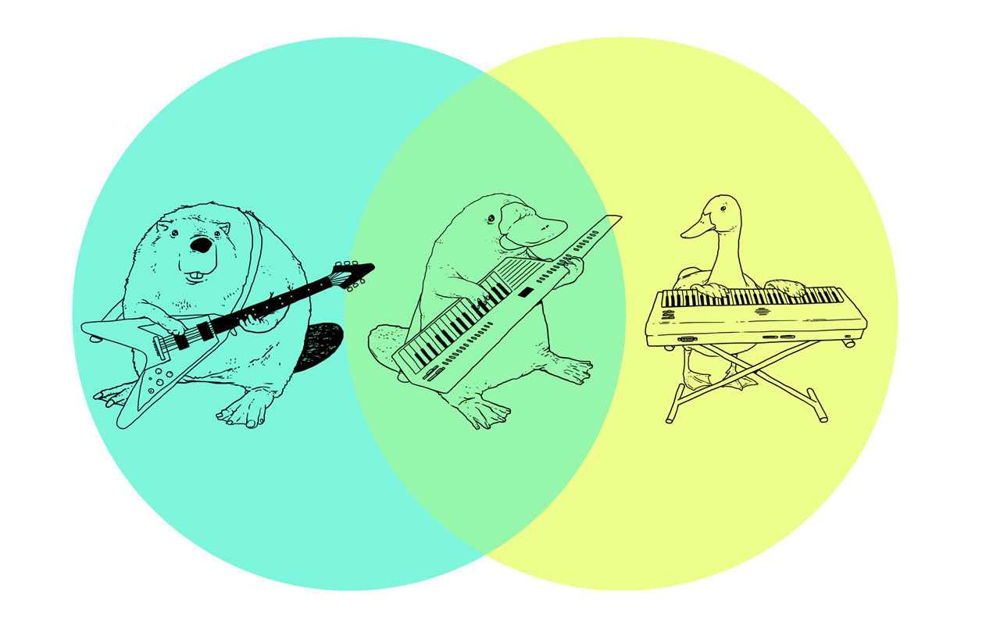

## Multivariate Stats II 



## PCA video

<iframe width="560" height="315" src="https://www.youtube.com/embed/FgakZw6K1QQ" frameborder="0" allow="accelerometer; autoplay; clipboard-write; encrypted-media; gyroscope; picture-in-picture" allowfullscreen></iframe>


## Discriminant Function Analysis {.build}

start with $p$ variables measured for $m$ groups.  

DFA finds a linear combination of the $p$ variables that maximizes the distance between groups

$$Z = a_1X_1 + a_2X_2 + ... + a_pX_p$$

DFA tries to maximise the F ratio of between group to within group variation ($M_B/M_W$)

This is an eigenvalue problem

## Discriminant Function Analysis {.build}


Assuming you have more measurements than groups, there will be $m - 1$ **canonical discriminant functions** that maximize the ratio $M_B/M_W$. 

These are indicated by $Z_1$, $Z_2$, $...$, $Z_{m-1}$.

$Z_1$ captures as much distance between groups as possible. 

$Z_2$ captures as much variation as possible, subject to the condition that the variation captured is uncorrelated (**orthogonal**) to $Z_1$, and so on with the remaining canonical discriminant functions. 

## Discriminant Function Analysis {.build .smaller}

First two discriminant functions often captures majority of group differences.  

If so, we can use  reduced set of variables to visualize $p$ dimensional dataset in 2 dimensions.


```{r, echo=FALSE, fig.height=4}
library(ggplot2)
x <- rnorm(50, mean=25, sd=8)
y <- rnorm(50, mean=24, sd=8)
x <- x * c(-1, 1)
y <- y * c(-1, 1)
qplot(x=x,y=y, color=rep(c("A", "B"), 25), size=I(5)) + theme_bw(30) + labs(x="LD1", y="LD2") + guides(color="none")
```

## Learn By Doing - DFA in R

```{}
library(MASS)
lda()
```

Do a DFA of the iris data using the `mass::lda()` function


## Correspondence Analysis {.build}


> *  A method for visualizing a 2-way contingency table
> *  The goal is to have rows (often taxa) and colums (often sites) appear in same ordination plot
> *  Often called ***reciprocal averaging***
> *  Site scores are weighted averages of species values, and species scores are a weighted > average of site values
> *  useful for count data and presence/absence

## Correspondence Analysis {.smaller}

```{r}
bovids <- read.table("https://stats.are-awesome.com/datasets/bovid_occurrences.txt", header=TRUE, sep="\t")
library(tidyr)
bovids <- spread(bovids, key=site, value=count)
row.names(bovids) <- bovids$taxon
bovids<-bovids[,2:9]
head(bovids)
```

## Correspondence Analysis {.smaller}

* `ca` package in R
*  Row points (red) appear close to rows with similar column values
*  Column points (blue) appear close to columns with similar row values

```{r echo=FALSE, fig.width=10, fig.height=4}
library("ca")
myCA <- ca(bovids)
qplot(x=myCA$rowcoord[,1], myCA$rowcoord[,2], label=rownames(myCA$rowcoord), size=I(8), geom="text", color=I("blue")) + 
  geom_text(aes(x=myCA$colcoord[,1], y=myCA$colcoord[,2]), label=rownames(myCA$colcoord), size=8, color="red") + 
  labs(x="Dimension 1", y="Dimension 2", title="Corresponce Analysis - Bovid Abundances") + 
  scale_x_continuous(limits=c(-2, 2))

```

## Correspondence Analysis {.smaller}

Code to do CA and make plot on previous page

```{r results="hide", fig.keep="none"}
library("ca")
myCA <- ca(bovids)
qplot(x=myCA$rowcoord[,1], 
      y=myCA$rowcoord[,2], 
      label=rownames(myCA$rowcoord), 
      size=I(8), 
      geom="text", 
      color=I("blue")) + 
  geom_text(aes(x=myCA$colcoord[,1], 
                y=myCA$colcoord[,2]), 
                label=rownames(myCA$colcoord), 
                size=8, 
                color="red") + 
  labs(x="Dimension 1", y="Dimension 2", title="Corresponce Analysis - Bovid Abundances") + 
  scale_x_continuous(limits=c(-2, 2))

```