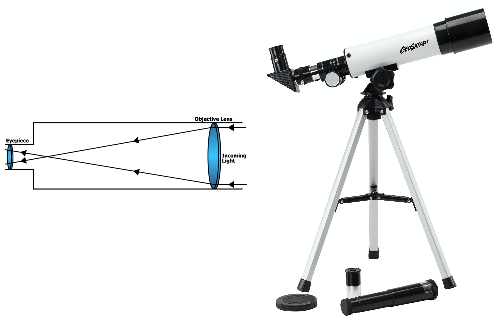
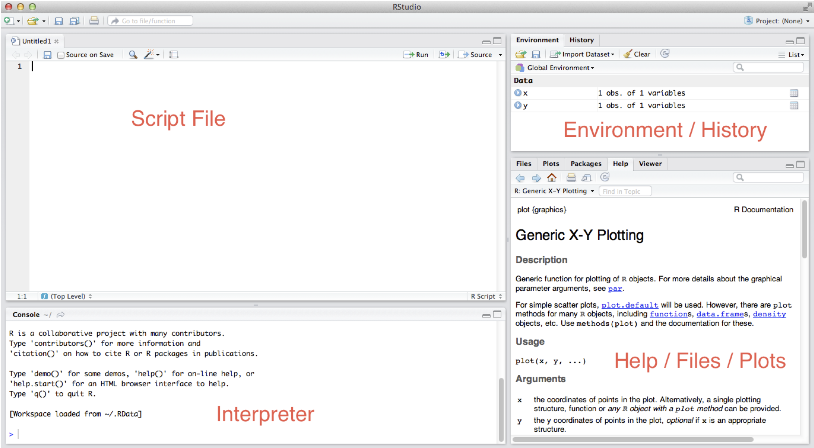
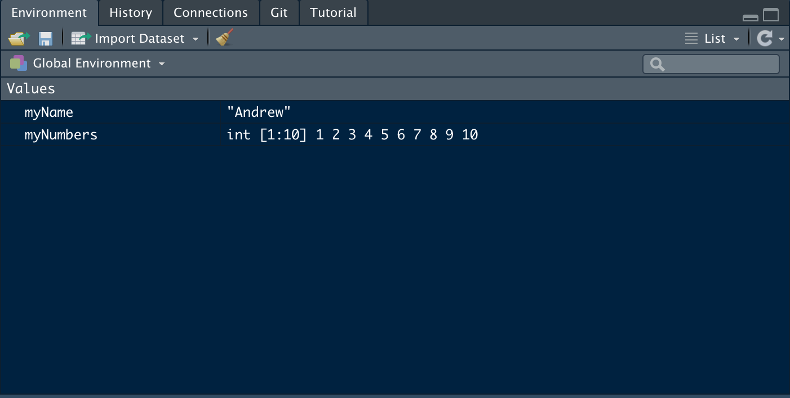

## Review

* What is a vector?
  * How do you index a vector?
* How would you pass a vector to a function?
* What is a factor?
* What is a dataframe
  * How do you index a dataframe
  
## What is a function?

Functions:

*  have a ***name***
*  accept 0 or more ***arguments***
*  do something useful with those arguments
*  produce a ***return value***

There are 1000s of already named functions

## Working in R {.build}

For the Intro to R tutorial, we typed commands directly into a browser. Now, we will use R on your own computer.

We are going to make use of a helper program called R Studio.  

## Get ready to switch back and forth {.build}


Depending on your screen size, you may prefer to have the slidsow and Rstudio visible (but narrow) on your computer, or to just switch back and forth between your web browser and R Studio. 

## R versus R Studio {.build .columns-2} 



In a telescope, light passes through the lenses. The geometry of the lenses determines what the resulting image looks like. The rest of the telescope (the tripod, the focus knobs etc.) make it easier to use.

R is like the lenses and mirrors.  R is the command line interpreter, which does the actual statistical work.

R Studio makes it easier to get your data into R, keep track of files, etc. (Like a tripod, it helps, but doesn't do the actual work). You don't need to cite R Studio in publications, you need to cite R (and which version you are using.)


## The RStudio Window

\

## The Workspace

Whenever you save variables (like we did in the tutorial), these get added to your workspace (technically they get added to the 'global environment').  

R Studio helpfully shows you the variables currently defined in the "Environment" tab.



## Scripts {.build}

Typing commands interactively into the command-line interpreter is fine for experimentation

Ultimately we want to save every single command to a text file, so that this can be run later, shared with collaborators, or published online with the article as supplementary information.  

**This element of reproducibility is a critical benefit of doing scripted data analysis.** This is one of the main reasons to use R and R Studio.  

## Scripts {.build}

In Rstudio, you can create a new script by clicking File >> New File. The first option should be "R Script".

Inside this script, you can type tons of commands on separate lines, and then run the commands all at once using the "Run" button at the top of the script file.  

Like in the online tutorial, when you type commands in a script, they don't get run immediately.  You have to click the "Run" button at the top of the Script window. (Alternatively you can use CTRL + ENTER or COMMANT + ENTER on a Mac) to run the line where the cursor currently is.  

## Challenge {.build}

> 0.  Open up R Studio on your own computer. 
> 1.  Create a new script file.     
> 2.  Create a variable called `numbers` that contains the numbers 1 through 100.  **Hint** use the `seq` function,  explore the `:` operator which was introduced in the online tutorial
> 3.  Create a new vector that contains only the elements of `numbers` that are greater than 36.  Save this to a variable called `bignumbers`
> 4.  Save your script file somewhere you can find it (like on your Desktop), 
> 5. In the Environment tab, click the broom icon to delete ALL saved variables! All your hard work has been wiped from R's memory (temporarily).
> 6. re-run your script file to redo all the steps listed above in a few microseconds

## R Markdown 

R Markdown documents are like scripts, but allow you to mix human readable text with snippets of R code.

At any time you can "knit" the R Markdown file, which causes the code snippets to be run. 

Any results (figures or text output) get combined with the human readable parts, and combined into a single pdf, word doc, or html file.  

You can create a new Rmarkdown using the File >> New File menu.

## Example R Markdown document

This sentence is just normal text, made for humans to read.  

The following bit is a "code chunk", which is set off by the \`\`\` characters and consists of actual R code that gets run, and the results knitted back into the document. 

You can also put R code inline like this.  What is 2 + 2? The answer is \`&#114; 2 + 2`.

\`\`\`{r examplechunk}<br>
x <- rnorm(100)<br>
y <- (x * 0.3) + rnorm(100, sd=0.2)<br>
plot(x,y,pch=16)<br>
\`\`\`


## Output of R Markdown after knitting


This sentence is just normal text, made for humans to read.  

The following bit is a "code chunk", which is set off by the \`\`\` characters and consists of actual R code that gets run, and the results knitted back into the document. 

You can also put R code inline like this.  What is 2 + 2? The answer is `r 2 + 2`.

```{r echo=TRUE}
x <- rnorm(100)
y <- (x * 0.3) + rnorm(100, sd=0.2)
plot(x,y,pch=16)
```


## Packages

One of the most important features of R is that it is has a vast ecosystem of user-contributed packages, which extend the base functionality of R.  

Packages can be installed from the command line `install.packages('ggplot2')` or by using the graphical package manager in Rstudio in the Packages tab. 

Each time you want to use functions from a package, you must make the package available with the `library()` function. 

## Data Input

Getting data into R can be very frustrating for new users.

This is because we tend to be sloppy when collecting data in a spreadsheet.

R has rigid expectations. 

> - each column of a text file should contain a single type of data (text, numeric, factor)
> - Each row should hold the observations for each column for a single individual
> - That's it. Period.  No extra rows that are just for formatting and don't contain data observations. 

## Data Input - graphical wizard

In the Environment tab, there is a tool called 'Import Dataset' That does exactly what it says it does.  This also works with Excel files, but reading from Excel files is more complicated than reading plain text files like CSV or TXT files where the columns are separated by commas ',' or tabs '\t'. 

These plain delimited text files are mostly what you will use as data in R.  


## Data Input - scripts 


The primary function for reading data into R is the `read.table()` function. There are a few important arguments.

*  `file` = The full path to the file as a text string. (Use the forward slash `/`, even on Windows.) You can also read from a remote URL (i.e. from the web).
*  `sep` = the character that separates columns in your text file.  The default is a single blank space `" "`, which kind of sucks because most of our files will be separated by either `\t` or `,`.
*  `header` = Whether or not there is a header row in your text file.  Defaults to `FALSE`, but usually we need it to be `TRUE`.


## Data Input - scripts 

An example

```{r eval=FALSE}
mydataset <- read.table(file="~/Desktop/cornbread-recipe-ratings.txt", sep=",", header=F)
```

This reads the file `cornbread-recipe-ratings.txt` which lives on my Desktop.  It saves the result to a variable called `mydataset,

Notice that the file name is the complete path to the file on your computer (this could also be a complete URL for a file that lives on the inter-tubes). Notice also, I have used the ~ character as a shortcut to your home directory on Windows or Mac. 

Always use forward slashes / in R, even on Windows.  

Once you have typed this "~/" in the R console window, you can hit the TAB key, and R Studio will start auto-completing the file path for you.  This is very helpul to not make mistakes. 


## Challenge 

Read in the file called "femur_lengths.txt" directly from the following URL

https://stats.are-awesome.com/datasets/femur_lengths.txt

Save to an object called `femora`.

Use the `str()` function to examine the data type of each column.  You can also do the same thing in R Studio in the Environment tab. 

Use the `mean()` function to calculate the mean of the femur lengths for *Tragelaphus scriptus* (don't consider other species).

## Data Output

Usually, I would recommend **not** writing out modified data frames to text files.  

It is far better to have a single input file, and to do all necessary manipulations in your saved R script file. 

But, if you need to write data, do it with `write.table()`

*  `x` = The name of the data frame to be saved. 
*  `file` = Path to the output file.  You can't use `file.choose()` though.
*  `quote` = Do you want quotation marks around strings? Defaults to `TRUE`
*  `sep` = Same as for `read.table()`
*  `row.names` = Do you want row names?  Defaults to `TRUE`, but usually you will set to `FALSE`


##  Challenge 

Add a new column of log transformed lengths to the `femora` dataframe and then write out the new file to your Desktop.

