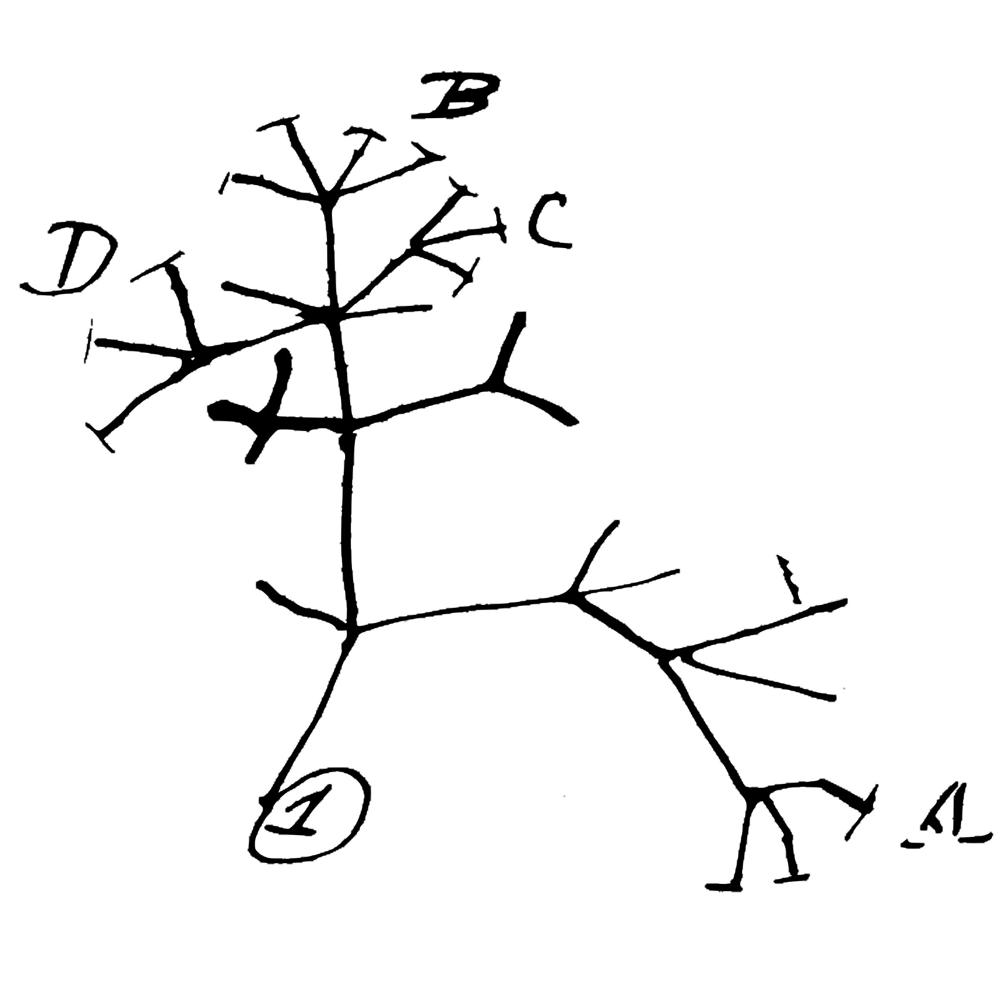

## Skills Bootcamp - Joining datasets {.smaller}

Suppose you had a dataset that looks like this:

| date | individual | direction of travel | individual natal group
|------|------------|---------|-------------|
| Jan 1 | LeRoy | North | Green Stars | 
| Jan 3 | LeRoy | North | Green Stars |
| Jan 1 | Lucinda | South | Black Stars |
| Jan 3 | Lucinda | North | Black Stars |

It is redundant to keep track of the natal group for each individual in this format, as the natal group never changes. 

Its not so bad in small datasets, but gets super redundant when you gets 100s of rows

## Skills Bootcamp - Joining datasets {.smaller}

Its better to keep them separate, and only join them together when you need to...

### Directions of travel

| date | individual | direction of travel | 
|------|------------|---------|
| Jan 1 | LeRoy | North |
| Jan 3 | LeRoy | North |
| Jan 1 | Lucinda | South |
| Jan 3 | Lucinda | North |

### Natal groups

| individual | natal group
|------|------------|
| LeRoy | Green Stars | 
| Lucinda | Black Stars |

## Skills Bootcamp - Joining datasets

Luckily, there is a `dplyr` function to do that...

```{}
library(dplyr)
left_join(table1, table2)
```

This will join the tables based on any columns that have shared names (in this case `individual`). 

If you need to manually specify (because columns have different names) you could do this


```{}
left_join(table1, table2, by = c("colname_from_table1" = "colname_from_table1"))
```

## Skills Challenge - Breakout


1. Read in these two datasets: https://stats.are-awesome.com/datasets/barr_astrag_2014.txt & https://stats.are-awesome.com/datasets/ungulateMasses.txt
2. Join these two dataframes together
3. What is the slope of the linear relationship between the B variable and the body mass variable?

## Comparative Methods
 



## Anatomy of a phylogenetic tree {.columns-2}


```{r, echo=FALSE, message=F, warning=F, fig.width=4}
set.seed(121)
library(phytools)
tree <- phytools::pbtree(b=1, d=0.3, n = 5, extant.only=TRUE)
plot(tree, show.tip.label = F, edge.width = 4)
nodelabels(pch = 16, col="royalblue", cex=2)
tiplabels(pch=15, col="sienna", cex=2)
```


***nodes*** are the blue circles

***tips*** are the brown squares

***edges*** connect nodes (and tips)

edges have a length (known as a ***branch length***)

trees are ***hierarchical***, the pattern of branching is the ***topology***, and the deepest node is the ***root node***

## Topology {}

```{r echo=FALSE, fig.height=3.5}
tree$tip.label <- LETTERS[1:length(tree$tip.label)]
par(mfrow=c(1,2))
plot(tree, edge.width = 2, label.offset = 0.1, cex=1)
plot(ladderize(tree), edge.width = 2, label.offset = 0.1, cex=1)
```


The topology represents a series of branching events, so these trees have identical topologies.

***The differences between these trees are purely aesthetic***

## Still same old topology

Note: all these trees are made using the basic `plot` function in R.  We will see more later.  

```{r echo=FALSE, fig.width=5, fig.height=5}
plot(tree, edge.width = 2, label.offset = 0.01, type="fan", cex=1.1)
```


## Phylogenetic Trees in R

> - The `ape` package provides functions for interacting with phylogenetic trees.

> - The most common file format for phylogenetic trees is the Newick format (which is incorporated in the Nexus format).

```{r}
textTree <- 
  "(Gibbon:1.6, (Gorilla:1, (Chimp:0.2, Human:0.2):0.8):0.6);"
```

> - Notice sister taxa are separated by a comma, enclosed in parentheses.  Branch lengths go after a colon after the taxon name. 

> - The structure is hierarchical, so read it from inside out. 

## Phylogenetic Trees in R

```{r echo=FALSE, fig.height=5}
myTree <- read.tree(text=textTree)
plot(myTree, edge.width=3, cex=2)
```

## Phylogenetic Trees in R

Trees in Newick format can be read with `read.tree()`

Tree on previous slide can be read and plotted as follows:

```{r echo=TRUE, fig.keep="none"}
plot(read.tree(text=textTree))
```

Trees in Nexus format (e.g. from the program Mesquite) can be read with `read.nexus()` 

Note: both of these functions are in the `ape` package.


## Phylogenetic Trees in R

Like most everything, a phylogenetic tree in R is just a special type of list (of class `phylo`)

```{r}
str(myTree)
```

## Phylogenetic Trees in R


`drop.tip()` - drops named tips from a tree

```{r}
myTree
```

## Phylogenetic Trees in R


`drop.tip()` - drops named tips from a tree

```{r}
drop.tip(myTree, c("Chimp", "Human"))
```

## Challenge - Together

> - Read in [this ruminant phylogeny](https://stats.are-awesome.com/datasets/ruminants.phy) (Hernández Fernández & Vrba, 2007) using the `ape::read.tree()` function.

> - Drop all tips except the following: `"Alcelaphus_buselaphus", "Sigmoceros_lichtensteinii", "Connochaetes_gnou", "Connochaetes_taurinus", "Beatragus_hunteri", "Damaliscus_lunatus", "Damaliscus_pygargus"`

> - Hint you can use `drop.tip()` or `extract.clade()`. 

> - Hint 2: supposing you named your tree `tree`, you can get a vector of all the taxon names by doing `tree$tip.label`.  This gets you a list of all, taxa, so you just need to remove the few taxa above that you don't want to drop to get your list of taxa to remove to pass to `drop.tip`


```{r echo=FALSE}
library(ape)
ruminants <- read.tree(file="https://stats.are-awesome.com/datasets/ruminants.phy")
```

## Challenge- Together

Plot the extracted clade of Alcelaphins

Experiment with:

*  `tip.labels()`
*  `node.labels()`
*  graphical parameters
  *  `tip.color`
  *  `edge.color`
  *  `cex` - label size
  *  see `?plot.phylo` for all possible graphics options

# Question


## What is the #1 assumption we have made in parametric stats throughout the semester?


# Answer

## Each observation is independent, and therefore residuals are independent and (hopefully) normally distributed

## The Problem - Graphically


### statistics assumes

```{r echo=FALSE}
plot(rescale(tree,"lambda", 0), type="fan", show.tip.label = T, edge.width=2, label.offset=0.01)
```

## The Problem - Graphically

### evolution provides

```{r echo=FALSE}
plot(tree, type="fan", show.tip.label = T, edge.width=2, label.offset=0.01)
```


## The Problem - Graphically

```{r echo=FALSE, warning=F, fig.height=3.5}
x <- rnorm(50, sd=0.69)
y <- x * 4 + rnorm(50, sd=0.66) + c(-1, 3)
species <- rep(c("A", "B"), 25)
library(ggplot2)
mylm <- lm(y~x)
gradeshift <- qplot(x, y, size=I(4), color=species) + 
  theme_bw(30) + 
  scale_x_continuous(limits=c(-1,1)) +
  geom_abline(slope=coef(mylm)[2], intercept=coef(mylm)[1], linetype=2) + 
  geom_segment(aes(x=x, xend=x, y=y,yend=mylm$fitted), linetype="dashed")
gradeshift
```


Regression assumes residuals are independent, but, sometimes residuals more likely to be ($\pm$) based on phylo.

This is called ***phylogenetic autocorrelation*** and causes problems

## The Problem is Insidious


```{r echo=FALSE, warning=F, fig.height=2}
gradeshift + theme_bw(15)
```


This example is extreme...some people call this a  ***grade shift***

Folks have long been wary of grade shifts (solution: separate analyses for groups)

## The Problem is Insidious

Even without obvious grade shifts, phylogenetic autocorrelation of residuals causes 2 problems:

*  increases variance of parameter estimates (e.g. slopes and intercepts)
*  increases Type I (false positive) error rate

## Recall the General Linear Model 

$$Y_i = \beta_0 + \beta_1X_i + \beta_2X_i +\ ... +\ \beta_nX_i  + \epsilon_i$$

where: 

* $\beta_0$ is the y-intercept (value of y where x= 0)
*  $\beta_1X_i$ is the slope value for the 1st x variable
*  $\epsilon_i$ is the error term, distributed as a normal random variable

The solution to the problem of phylogenetic autocorrelation is to relax assumptions about the error term.

## Generalized Linear Model

> - Similar in structure to general linear models, but allows specification of the assumed residual error structure

> - This error structure is represented as an expected variance/covariance matrix 

> - Requires branch lengths and a particular model of evolution

> - The most common assumed model of evolution is ***Brownian motion***

## Brownian Motion

```{r echo=FALSE, fig.height=2}
library(ggplot2)
n <- 1500
y <- cumsum(sample(c(-1.1, 1.1), n, TRUE))
qplot(x=1:n, y=y, geom="line") + theme_bw(15) + labs(x="time step", y="trait value")
```
 
 
> - Traits evolve in a random direction at each time step, independent of previous changes

> - ***Assumes no natural selection***

> - ***Assumes constant rate of change***

> - Brownian motion is assumed in most studies you will read which are trying to "correct for phylogeny" (not a very useful way to talk about it)

 
## Phylogenetic Generalized Linear Model {.smaller}

```{r echo=FALSE, fig.height=3.5}
threeTaxa <- extract.clade(tree, 7)
threeTaxa$tip.label <- c("Gorilla", "Chimp", "Homo")
threeTaxa$edge.length <- threeTaxa$edge.length + c(0.3, 0.3, 0, 0)
plot(threeTaxa, tip.color = "blue")
text(c(0.5,0.5,0.95,0.95), c(1.15,2.65,2.15,2.85), round(threeTaxa$edge.length,2), cex=0.7)

```


> - Homo and chimp have much shorter branches connecting them than chimp and gorilla

> - Branch lengths represented as ***variance/covariance matrix*** using functions in `ape`

> - We use this phyloVCV in pGLM, instead of a normal error term. (Often called PGLS, but pGLM is more general term)


## Quantifying Phylogenetic Signal

> - Residual autocorrelation in proportion to the Brownian VCV is a reasonable starting assumption, but we don't want to always assume this

> - Better to estimate how much phylogenetic signal exists

> - ***$\lambda$ provides this estimate***

> - varies between 0 and 1, and scales the branch lengths of the tree (and thus the VCV matrix)

## lambda - branch length transformations


```{r echo=FALSE}
par(mfrow=c(2,2), cex.main=3)
plot(tree, show.tip.label = FALSE, main="lambda=1", edge.width=3)
plot(rescale(tree, "lambda", 0.8), show.tip.label = FALSE, main="lambda=0.8", edge.width=3)
plot(rescale(tree, "lambda", 0.4), show.tip.label = FALSE, main="lambda=0.4", edge.width=3)
plot(rescale(tree, "lambda", 0.0), show.tip.label = FALSE, main="lambda=0", edge.width=3)
```


## Estimating lambda

> - when doing PGLS, you can estimate the most appropriate value of lambda for your data

> - if $\lambda = 0$ then PGLS is equivalent to general linear model (non-phylogenetic)

> - if $\lambda = 1$ then PGLS is equivalent to phylogenetically independent contrasts (an older way of "correcting" for phylogeny)

## Other models of evolution

> - Even when we estimate lambda, we are only slightly relaxing our assumption that our trait evolved by Brownian motion.  

> - There are other models of trait evolution such as:

> - Ornstein-Uhlenbeck: like Brownian motion but with stabilizing selection around some 'optimum' value (or multiple 'optima')

> - Early Burst: model of trait evolution where evolution happens faster near the root of the tree, slower towards tips

> - We won't consider these further, but if you are serious about comparative stats, you need to explore whether other models besides Brownian are more appropriate.

## PGLS in R

`caper` package is most user friendly

Three steps:

0.  Read in your data and your tree
1.  Use the `comparative.data()` function to match up your tree with your dataframe
2.  Use the `pgls()` function, specifying that lambda should be estimated by maximum likelihood

Example: 

```{}
pgls(response ~ predictor1 + predictor2, data=myCompData, lambda="ML")
```

## Challenge 1 (together)

> - Read in this data on ungulate brain and body size https://stats.are-awesome.com/datasets/ungs.txt

> - Replace the spaces in the Species columns with underscores.

> - you will use this data frame in the next part of the challenge.

## Challenge 2 (breakout)

> - Read in this phylogenetic tree using the `ape::read.nexus()` function https://stats.are-awesome.com/datasets/BinindaEmondsBestDatesUngulates.nex 

> - Plot the tree

> - Use the `caper:comparative.data()` function to make the comparative data object. 

> - Do a PGLS testing the hypothesis that ungulate brain size is a function of body size and diet, while controlling for phylogeny assuming a brownian motion model of evolution. 

> - What is the maximum likelihood of lambda? Is diet a significant predictor of brain size?  What about body size?

## Generalized LS ain't just for phylogenies

> - Phylogenetic autocorrelation is just one kind of residual autocorrelation.  Spatial autocorrelation is another type......

> - **Generalized** Least Squares is the big family of models which have non normal error terms.
