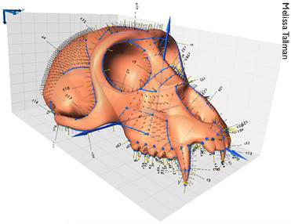
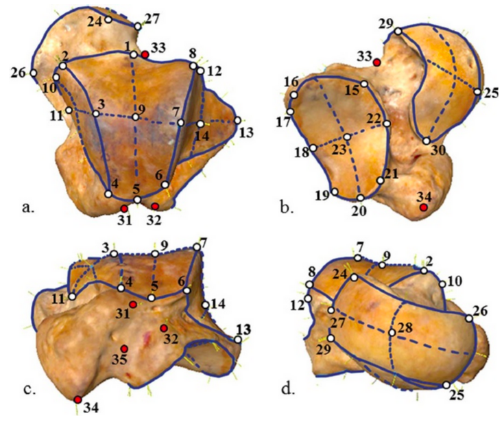
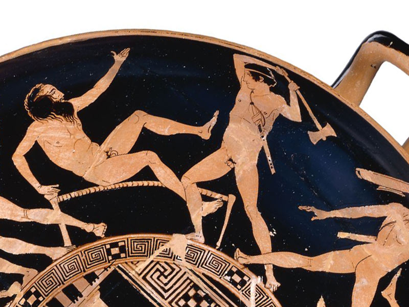

## 


## Geometric Morphometrics (GM) 



> * a technique used in shape analysis. But what is shape?

> * geometric aspects of an object that aren't its size, position, and location

> * GM involves the analysis of Cartesian geometric coordinates rather than length, area, volume measurements

## Steps in a GM analysis {.build}

using the `geomorph` package in R

> 1.  Get coordinate data (e.g., digitize outline from a photo, use a microscribe, get 3D coordinates from surface scanned specimen, etc)
> 2.  Perform a Generalized Procrustes Analysis (GPA)
> 3.  Analyze and visualze the results from the GPA

## GM - Step 1 - Coordinates {.build}




> *  involves capturing homologous ***landmarks*** or ***semi-landmarks***
> *  can be 2D or 3D
> *  each specimen will have a unique ***configuration*** of landmarks in its own coordinate system

## GM - Step 1 - Coordinates {.build .smaller}

We will use 2D coordinate data of salamander head shape stored in the `plethspecies` variable

note that the landmark data is in a $p\ (landmarks) \times k   \ (dimensionality) \times n\ (individuals)$ array

```{r message=F}
library(geomorph)
data(plethspecies)
plethspecies$land[,,1]
```

## GM - Step 1 - Coordinates {.build .smaller}

Notice that our `plethspecies` has more than landmarks, it also has a phylogenetic tree

We will explore these more next week, but just take brief look

```{r}
plot(plethspecies$phy)
```


## GM - Step 2 - Procrustes 



## GM - Step 2 - Procrustes {.build}

> * Translates all configurations to the origin
> * scales them to centroid size
> * rotates them until the ***Procrustes distance*** between configurations is minimized


## GM - Step 2 - Procrustes {.build .smaller}


```{r results='hide'}
GPA_pleth <- gpagen(plethspecies$land)
```


```{r}
GPA_pleth
```

## GM - Step 3 - Do PCA {.smaller}


```{r}

PCA <- gm.prcomp(GPA_pleth$coords)
summary(PCA)
```


## GM - Step 3 - Plot PCA {.smaller}

```{r}
plot(PCA)
```

## Alternatively plot phylomorphospace {.smaller}

```{r fig.height=4}
PCA_phylo <- gm.prcomp(GPA_pleth$coords, phy = plethspecies$phy)
plot(PCA_phylo, phylo = TRUE)
```

Check out the `picknplot.shape()` for help visualizing the grids

## GM - Step 3 - Further Analyze and Visualize {.build}

you can do TONS of analyses using the functions in the `geomorph` package

Questions?