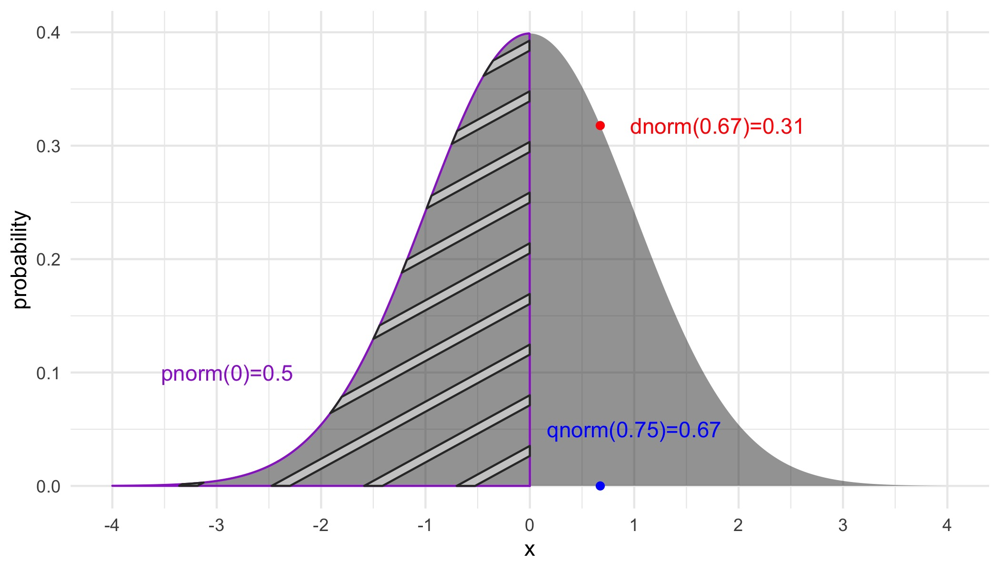
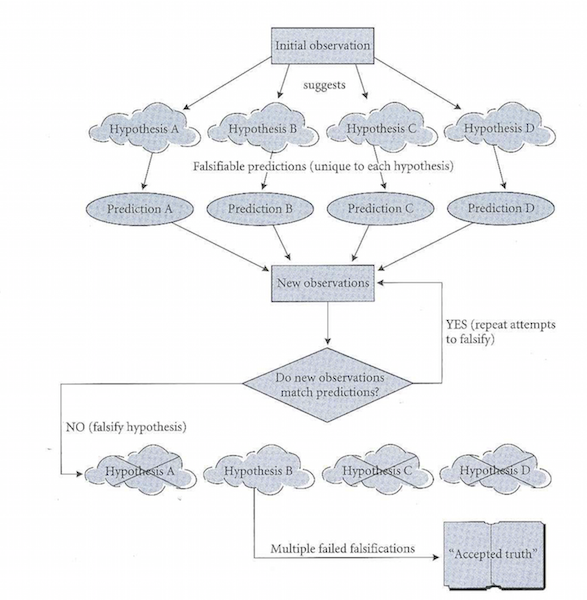
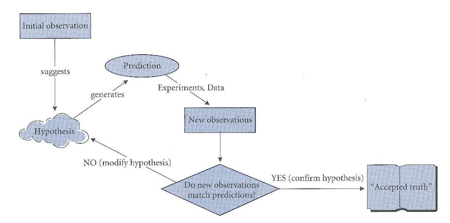
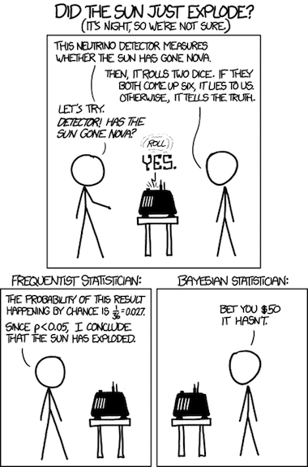
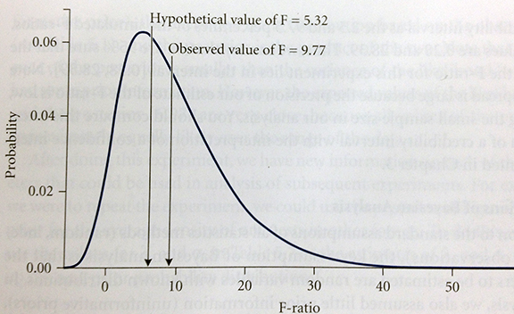

## Review

Who can explain this slide for me!?




## Hypothesis Testing 

```{r echo=FALSE}
library(ggplot2)
theme_set(theme_bw(20))
```


## Inductive *versus* deductive reasoning 


***Induction*** is bottom up approach to reasoning, proceeding from specific observations to general explanations.  

***Deduction*** goes the other way: from general to specific. 

All methods of doing science use both inductive and deductive reasoning, but the emphasis that they receive differs. 

## Deduction 




## Deduction  


*  Emphasis is on falsification
*  Requires multiple working hypotheses
*  In the end, there is (hopefully) only one that hasn't been falsified
*  Limitation: "correct" hypothesis MUST be among the alternatives studied


## Induction 





## Induction 


*  Emphasis is on confirmation
*  Builds and modifies hypothesis based on previous knowledge
*  Limitation: may "get off on wrong foot" if hypothesis is just plain wrong


## Testing Hypotheses 


Consider a [dataset of femoral head diameters](https://stats.are-awesome.com/datasets/baboons.txt) from male and female baboons. 

***Make a boxplot of FHD by sex with points overlaid on the boxes.*** 


```{r echo=FALSE, message=FALSE, warning=FALSE, fig.height=4.5}
library(ggplot2)
baboons <- read.table("https://stats.are-awesome.com/datasets/baboons.txt", header=TRUE)

qplot(x=SEX, y=FHD, data=baboons, 
      main="Baboon FHD by Sex", geom="boxplot") + 
  geom_point(color="red", size=3)
```

## Null Hypothesis  {.build}


The null hypothesis is the simplest possible explanation for a phenomenon.  This explanation is usually that random variation is responsible for any apparent pattern.

**Question**: In the case of our baboons, what is the null hypothesis?

## Alternatives to the Null {.build}

Next, we create one or more statistical alternative hypotheses.  

Alternative = difference between male and female femoral head diameters is too great to be accounted for by chance alone. 

Most of the time, we don't explicitly specify the alternative, we just suffice it so say that the alternative is "not $H_0$"

The alternative hypothesis is focused on the pattern in the data...not the cause of it. 

## The all powerful p-value 


In terms of conditional probability, the p value represents 

$$ P(Data\ |\ H_0) $$

## The all powerful p-value {.build}


For baboons, we might use a T-test to compare means.

Like all parametric statistics, the T-test returns a ***test statistic***.

Because we are assuming that the null hypothesis is true for the moment, we can compute an expected T distribution.

## The all powerful p-value 

```{r echo=FALSE}
library(ggplot2)
xrange <- seq(-15, 15, 0.05)
qplot(x=xrange, y=dt(xrange, df = 1000), geom="line",  main="Density of T-Distribution df=1000")

```

## The all powerful p-value 

```{r echo=FALSE}
qplot(x=xrange, y=dt(xrange, df = 24), geom="line",  main="Density of T-Distribution df=23") +
  geom_vline(xintercept = -12.4224, col="red") + 
  annotate(geom="text", x=-9, y=.3, label="Observed T", color="red")
```

Which R function would tell me the *cumulative* amount of probably density in this distribution up to our observed value?

## The all powerful p-value 


Our T-test would return a very low p value.

Highly unlikely to get two sex groups with means as different as ours, if the variation was attributable only to chance. 
We know this because we know the distribution of the T statistic when the null hypothesis if true. 

## If you only remember one thing from this class... 

**<span class='red2'>The p-value is an estimate of how likely our data are, assuming the null hypothesis is true.</span>**

Low p values do not mean the alternative hypothesis has been proven.

## Errors in Hypothesis Testing 


The Truth | Retain $H_0$ | Reject $H_0$
---------|----------------|---------
$H_0$ True | Correct! | Type I error ($\alpha$)
$H_0$ False | Type II error ($\beta$)| Correct!

## Errors in Hypothesis Testing 


Which type of error is worse?

## Errors in Hypothesis Testing 


***Statistical power*** is related to Type II errors, and is calculated as $1 - \beta$. 

This tells us how likely we are to detect an effect when one actually exists. 

Before starting a study it is worth doing a ***power analysis*** to determine the rate at which an effect of a given size will be detected with a given sample size. 

## Errors in Hypothesis Testing 


The risk of Type I and Type II error rates are inversely related to one other. 

This relationship is not simple, though. Type II error rates depend on a lot of things, like the sample size and strength of the effect.

## Statistical Significance versus Significance 


Given very large sample sizes, the risk of Type II errors is low, but this also means the risk of Type I errors is high. 

Tiny, virtually meaningless differences can become statistically significant.

When you find statistical significance, you have to ask 

> - how big is the effect? 
> - should I care?

## Statistical Significance versus Significance {.columns-2}

```{r echo=FALSE, fig.width=5, fig.height=5}
pops <- data.frame(height=c(rnorm(1000000, mean=176.4), rnorm(1000000,mean=176.57)), pop=c(rep("A", 1000000), rep("B", 1000000)))

ggplot2::qplot(x=pop, y=height, data=pops[sample(1:nrow(pops), 10000),], fill=pop, geom="boxplot") + ggplot2::theme_bw(20)

```

- Two populations (n=1,000,000)
- differ in height by about 0.01% (p<0.0000000001)
- **Should I care? Is this biologically meaningful?**
- Depends....but for many questions the answer is no. 
- 'Significant' means differences beyond chance expectations
- 'Effect size' is how big the difference is.  This is what is biologically important

## Statistical Significance versus Significance 

<span class='red2'>**Don't be a blind follower of $p<0.05$ !!!!!**</span>

<span class='red2'>**p-values don't measure effect size!!!!**</span>


## Statistical significance versus effect size {.smaller}

Many bacon lovers learned difference between effect size and significance a couple of years ago...


## Three Hypothesis Testing Frameworks 

We will walk through testing the same hypothesis in all three frameworks

*  Monte Carlo
*  Parametric
*  Bayesian

## Our example data 

[Ant data](https://stats.are-awesome.com/datasets/gotelli_ants.txt) from Gotelli CH 5 

***Read this data into R yourself!***

```{r echo=FALSE}
ants <- read.table("https://stats.are-awesome.com/datasets/gotelli_ants.txt", header=TRUE)
```

Lets test the hypothesis that habitat type influences ant distributions. Based on this hypothesis, we would expect that the number of ant nests in forests differs from the number of ant nests in fields. 

<span class="emhpasized">What is the null hypothesis here?</span>

## Monte Carlo {.columns-2}


Town of Monte Carlo 

Monte Carlo refers to a world-famous casino, in a town on the French Riviera (in the Principality of Monaco).

In Monte Carlo analysis, data are randomly reshuffled over and over to specify the null hypothesis, and these reshufflings are compared against the observed data.


## Monte Carlo 

***There are four steps:***

1.  Decide on a test statistic
2.  By reshuffling, create a distribution of the test statistic that would be expected under the null hypothesis
3.  Decided on a one-tailed or two-tailed test
4.  Compare the observed to the null distribution and calculate the p value.

## Monte Carlo - Step 1 - Test statistic 

We will use the absolute value of the difference in group means.  We will need to calculate this over and over, so we will make a function to do it.

```{r message=F}

abs.mean <- function(df){
  library(dplyr)
  means <- 
    df %>%
    group_by(Habitat) %>%
    summarize(meanAnts = mean(n_Ants))
  return(
    abs(means$meanAnts[1] - means$meanAnts[2])
    )
}

abs.mean(ants)
```

## Monte Carlo - Step 2 - Shuffle 


Now, we reshuffle the ant nest counts with the `sample()` function. ***Note:*** by default, the function draws a sample of the same size as the original vector, without replacement.

```{r}
ants$n_Ants
sample(ants$n_Ants)
```

## Monte Carlo - Step 2 - Shuffle 

We can do this 1000 times by using a for loop


```{r message=FALSE, warning=FALSE}
results <- numeric(1000)

for(i in 1:1000) {
  
  mix <- ants
  mix$n_Ants <- sample(mix$n_Ants)
  results[i] <- abs.mean(mix)
}
```

## Monte Carlo - Step 2 - Shuffle 


We can look at the results with a histogram

```{r echo=FALSE}
histres <- qplot(results, bins=10, color=I("white"), main="mean differences, shuffled counts") + theme_bw(24)
histres
```

## Monte Carlo - Step 3 - one or two tailed? {.columns-2 .smaller}


```{r echo=FALSE, fig.width=4, fig.height=4, message=F, warning=F}
histres + 
  theme_bw(13) + 
  geom_vline(color="red", linetype='dashed', xintercept=abs.mean(ants)) +
  annotate(geom="text", x=2.9, y=250, label="observed\ndifference", color="red")
```

When we compute the p value, we will ask how many mean differences computed on the randomized data are as extreme or more extreme compared to our observed mean difference. This is known as the ***tail probability***.

Should we look at just one side of the distribution or both?

We are looking at the absolute value, of the difference, ***so we want a 1 tailed test.***


## Monte Carlo - Step 4 - Calculate p {.build}


To get our 1-tailed p-value, we just count up how many of the mean differences in the randomized data are as big as (or bigger than) our observed mean difference (3.75).

```{r}
count_extreme_diffs <- sum(results >= 3.75)
count_extreme_diffs / 1000

```

Shortcut...

```{r}
mean(results >= 3.75)
```

for a <span style="color:gold;">&#9733;</span> who can explain how this works?

## Monte Carlo  


***What does our p value of `r mean(results >= 3.75)` mean?***

If there is no relationship between habitat and and nest count, we would expect to observe data with a mean difference as extreme or more extreme than ours about `r round(mean(results >= 3.75)*100, 2)`% of the time. 

## If you only remember one thing from this class... 

**<span class='red2'>The p-value is an estimate of how likely our data are, assuming the null hypothesis is true.</span>**

Low p values do not mean the alternative hypothesis has been proven.

## Monte Carlo Pros and Cons {.build}


Pros:

> - fewest assumptions
> - null hypothesis is very clear and easy to understand

Cons:

> - you have to "roll-your-own"
> - you don't get the same answer every time

## Parametric 


## Parametric 

Assumes data were sampled from a specified distribution (usually normal distribution). 

Parameters of this distribution used to calculate tail probabilities data given a null hypothesis. 

$$P(data\ |\ hypothesis)$$

## Question....

Which R function computes tail (i.e. cumulative) probability for the normal distribution?

`dnorm()`?

`pnorm()`?

`qnorm()`?

`rnorm()`?


## Parametric 


1.  Specify the test statistic
2.  Specify the null distribution
3.  Calculate the tail probability


## Parametric - Step 1 - Test Statistic 


F statistic or F ratio - useful for comparing whether group means differ

Basis for ***ANOVA***

$$ F = \frac{(variance\ between\ groups + variance\ within\ groups)}{variance\ within\ groups}$$


## Parametric - Step 1 - Test Statistic 


We will spend a lot of time talking about how to calculate the F ratio

Our F-ratio in the case of the ant nests is 

$$ F = 33.75 / 3.84 = 8.78 $$

## Parametric - Step 2 - Specify null dist 


The null hypothesis is data were drawn from  single population.

If true, then our F ratio tends to be about 1 (similar variance between and within groups)

Larger and larger values of F are less and less likely to be observed under the null hypothesis.  

The F statistic follows a known ***F distribution***.

## Parametric - Step 2 - Specify null dist 

 

```{r fig.width=9, fig.height=5, echo=F}
xrange <- seq(1, 14, 0.1)
yvals <- df(xrange, df1 = 1, df2=8)
fdist <- qplot(x=xrange, y=yvals, geom="line") +  theme_bw(20) + 
    labs(x="F statistic", y="probability")
fdist

```


## Parametric - Step 3 - Compute the p-value {.columns-2}

```{r fig.width=4, fig.height=4, echo=F}
fdist + 
  geom_vline(xintercept = 8.78, col="red")
```

The upper tail probability can be computed easily because we are dealing with a known distribution. 

```{r}
1 - pf(8.78, df1=1, df2=8)
```


## Parametric - Step 3 - Compute the p-value 

For another <span style="color:gold;">&#9733;</span>

***Who can tell me what this p-value of 0.018 means?***

## If you only remember one thing from this class... 

**<span class='red2'>The p-value is an estimate of how likely our data are, assuming the null hypothesis is true.</span>**

Low p values do not mean the alternative hypothesis has been proven.

## Parametric Assumptions 


>- data independent
>- data come from specified distribution
>- additional tests make additional assumptions - these are sometimes most critical

## Parametric Pros and Cons {.build}


Pros

>- ubiquitous in standard stats packages, textbooks, articles
>- extremely well understood (by statisticians)

Cons

> - easy to misuse
> -  p values misinterpreted
> -  assumptions not always tested
> - less flexible than Monte Carlo

## Bayesian 


Bayes' theorem discovered by Rev. Thomas Bayes in the mid-18th century

Based on ***inverse probability***

## Bayesian 


<br>   
$$P(hypothesis\ |\ data) = \frac{P(hypothesis) * P(data\ |\ hypothesis)}{P(data)}$$
<br>    
$$Posterior\ Probability = \frac{Prior\ Probability * Likelihood}{Marginal\ Likelihood}$$


## Bayesian 

1.  Specify the hypothesis
2.  Specify the parameters as random variables
3.  Specify the priors
4.  Calculate the likelihood
5.  Calculate the posterior
6.  Interpret

## Bayesian - Step 1 - Hypothesis 

Turns the question around compared to parametric. Considering our ants:

Parametric asks: $$P(F_{obs} = 8.78\ |\ F_{theoretical})$$

Bayesian asks: $$P(F\geq5.32\ |\ F_{obs} = 8.78)$$

***Note:*** 5.32 is the critical value from this F distribution, used to mathematically specify alternative hypothesis.


## Bayesian - Step 2 - Parameters 


Specify parameters as random variables, instead of assuming there is a single fixed (but unknown) value of parameters

So the mean of the ants in the field would be: $$ \mu_{field} \sim N(\lambda_{field}, \sigma^2)$$


## Bayesian - Step 3 - Priors 


$$Posterior\ Probability = \frac{Prior\ Probability * Likelihood}{Marginal\ Likelihood}$$

What are the expected probability distributions for our parameters ***before*** we do the experiment?

Can either use uninformative ***flat*** priors, or base them off of our previous knowledge about ant colony densities in field and forest. 

## Bayesian - Step 3 - Priors {.columns-2}



Incorporating ***prior*** knowledge into hypothesis testing is fundamental distinction

## Bayesian - Step 4 - Likelihood 

Next we estimate the likelihood.

$$Posterior\ Probability = \frac{Prior\ Probability * Likelihood}{Marginal\ Likelihood}$$

The standard probability $P(data\ |\ hypothesis)$ is the probability of our data given the null hypothesis. 

Likelihood is proportional to probability, but:

*  based on a single dataset, can be recalculated based on many different parameter values
*  doesn't sum to 1 (first axiom of probability)

## Bayesian - Step 5 - Posterior 


$$Posterior\ Probability = \frac{Prior\ Probability * Likelihood}{Marginal\ Likelihood}$$

Now we just do the math to calculate the posterior distributions for our parameters.  We can then use Monte Carlo to produce an expected distribution of F value with our posterior values. 



## Bayesian - Step 7 - Interpret 


Tail probability of observed F in our simulated F distribution is P = 0.67

Much higher than our parametric or Monte Carlo estimates

Would change if we used different priors

## Bayesian {.build}


Pros

>- Explicitly builds on previous work (which reflects scientific progress, and the way we think)
>- Intuitive interpretation, less prone to cookbook critical values of p

Cons

>- It is really friggin' complicated
>- Use of different priors results in different information, potentially subjective

## Summary {.build}


Most of what you do will be parametric stats: be sure to think about assumptions

Be very careful about $\ p < 0.05$

Bayesian offers a powerful (if complicated) alternative

Monte Carlo is flexible and awesome, and you should do it!