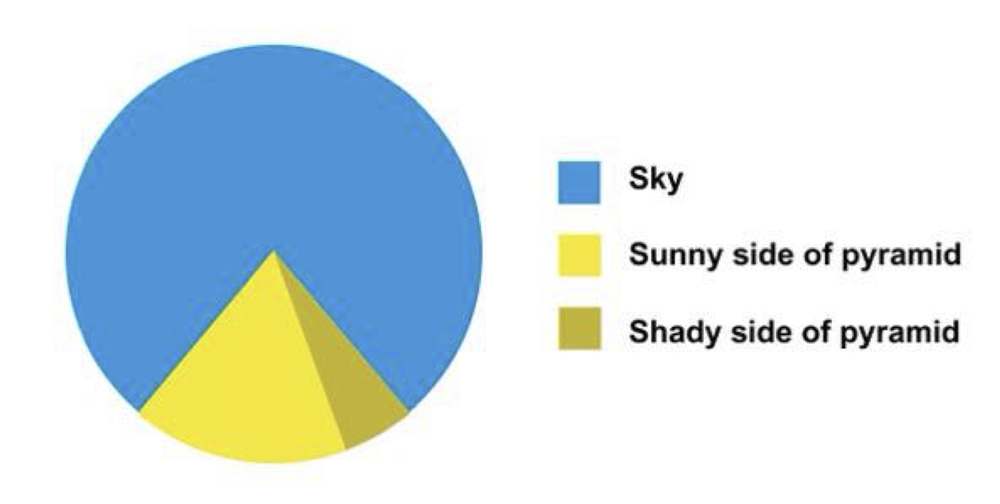
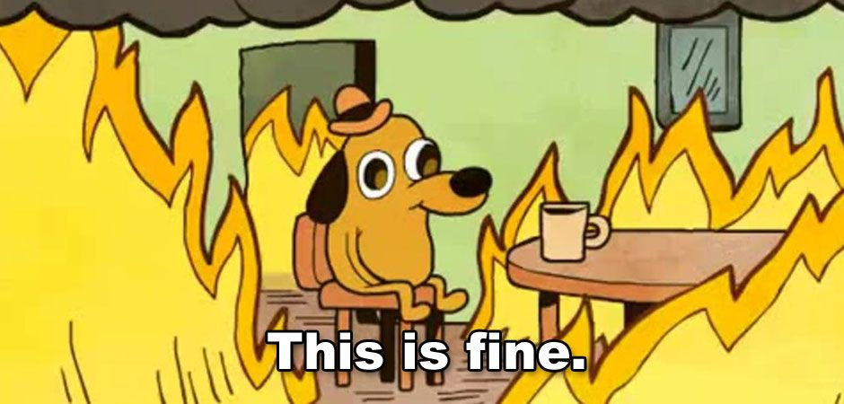
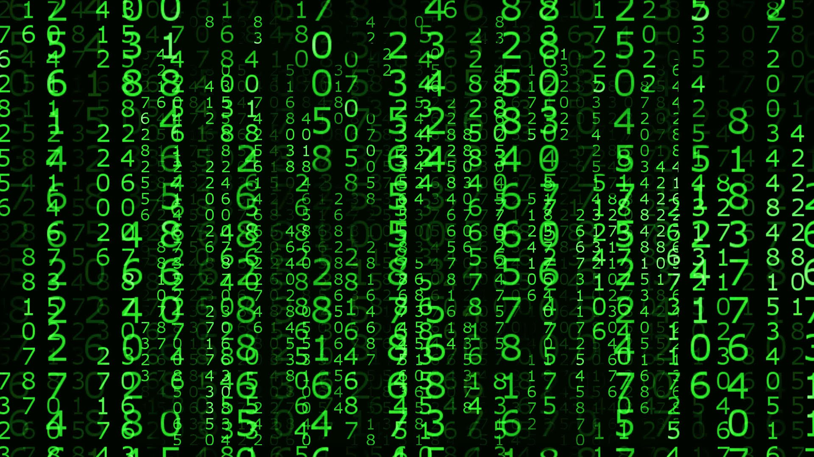
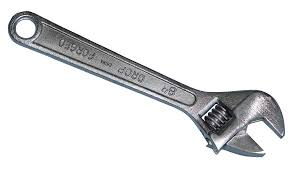

## Welcome to ANTH 6413!

this is the only pie chart you will see all semester.

## 

## Statement about the world we live in {.build}

As your instructor, I recognize that the COVID-19 pandemic and the current state of our country has far reaching effects that are felt unevenly for different people based on their personal circumstances including (but not limited to): 

> *  exposure to systemic injustice
> *  financial situation
> *  housing situation
> *  childcare responsibilities
> *  mental and physical health status
> *  health status of family members

My goal is to be as flexible as I can be with each student so that everyone can meet the learning objectives for the course despite the difficulties we face.

## Course Goals

> - Gain the statistical knowledge to critically evaluate the use of statistics in the literature of bioanthro and related fields. 
> - Get hands-on experience implementing analyses with real world data
> - Learn practical tools for doing "data-science"

## Student introductions

Lets take a minute to introduce ourselves.  

What do you want to be able to do in 14 weeks that you can't do today? (in regards to this class)

## All fields are becoming more data intensive

  

## "Data-science"

**Data science** is an industry buzzword and cliche

From wikipedia:

> "Data science is an interdisciplinary field about **processes and systems**
> to **extract knowledge or insights from data**.

> - In private industry, you extract insight from data to make business decisions. 
> - **It is also a big part of what scientists do!**
> - Processes and systems for getting insight from data are important!

## Data science pipeline

## Confession: I believe tools matter, a lot

> - We will spend a lot of time on the "how"
> - You will become very familiar with the nuts-and-bolts of analyzing data
> - Most of your grade comes from practical exercises
> - I dont expect you to be a statistician (I sure as hell am not). But I do expect you to learn **how to extract insights from data**

## Grading

Assignment                  | Percent
--------------------------------------------------------|---------------
Weekly homework assignments - submitted on Blackboard  | 40%
Practical Exam 1 | 12.5%
Practical Exam 2 | 12.5%
Original Analysis (due Dec 9th) | 15%
Critical Evaluation (due Nov 11th) | 10%
Participation in class | 10%

## Lecture videos {.build}

Classes will be held in person

Classes will be recorded, and the recordings will be available for a limited time only (due to space constraints in storage). 

Recordings are not for download and distribution.

Your primary study materials will be the lecture slides (available on course website) and your notes from class, not the recordings which are temporary.  

## Class ground-rules

These are especially important for breakout-groups, when I am not there all the time. 

> 1. Be respectful - language matters
> 2. Don't make assumptions about individuals abilities or experiences
> 3. Don't dominate the discussion - leave room for others to speak
> 4. Do keep it lighthearted! This is hard, but learning is fun, y'all!

## Homework {.build}

There are weekly homework assignments in this class.  

These are where you will really learn to do data analysis.  I will walk you through the concepts in class, but you will learn by doing. 

Homework assignments will be uploaded to Blackboard, and are due by the beginning of class on their due date.  

**Note**: First homework assignment is due on September 9th. 

I am not a monster and this is a global pandemic, but in order for you to learn, you need to do these in a timely fashion, because concepts build on one another fast!

## Outcome of the course

When you leave this course, I hope you are empowered to:

> -  collect your data in a format that makes your future life easier
> -  explore patterns in your data visually and statistically
> -  test meaningful hypotheses using appropriate statistical tools
> -  communicate these results effectively using graphs and prose

## Tools of the Trade

> - MS Excel
> - Commercial Statistics Packages (e.g., SPSS)
> - R – open source and free package for statistical analysis

## Tools of the Trade

- MS Excel
- ~~Commercial Statistics Packages (e.g., SPSS)~~
- R – open source and free package for statistical analysis

## Why do I use R?

> - **Ignorance** - Because I don’t know how to use anything else
> - **Comprehensiveness** – Learn this one tool well, and you can do (almost) ANYTHING
> - **Reproducibility** – an R script is a detailed record of exactly what I did, from the raw data file, through data transformation, to analysis and results.
> - **Popularity** - R is insanely popular in academia and in industry ("why hello there, marketable skills!")

## What is R?

R is an **open-source** language and environment for statistical computing and graphics. 

**open-source** means that anyone can look at the code to see how it works.

## What is R?

One of the top 10 most widely used programming languages in the world in 2018.

## What is R?

A rapidly growing system of user contributed packages.

##

## Course Website

https://stats.are-awesome.com

Let's check out the website then we will do the introduction to R

## Intro to R {.build}

We are going to do an interactive tutorial that I wrote. 
 
Download the folder at this link: <a href="https://www.dropbox.com/sh/fvh4y3lzlualyqv/AADjPOcqUe4hzRbUF9v92RmZa?dl=0">link</a>

Be sure you have installed the `learnr` package. Who needs help doing this?

We will spend about 40 minutes on the tutorial

