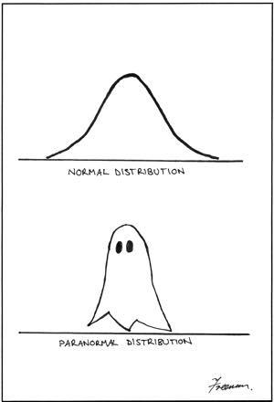

---
output:
  ioslides_presentation:
    widescreen: yes
---

## The spookytime 



## Power Analysis allows you to ask:

<div class="red2">How big of a sample do I need to detect a given effect size with a given level of confidence?</div>


## Steps in a power analysis {.build}


> - decide on parameters for effect size, error magnitude

> - decide how much power you want

> - write a function to simulate data with your effect size, error magnitude, sample size

> - write a for loop to increase sample size until desired power is achieved

##

</img>

Why is having too much power A BAD THING?

## Type of errors - Redux {.build}

The Truth | Retain $H_0$ | Reject $H_0$
---------|----------------|---------
$H_0$ True | Correct! | Type I error ($\alpha$)
$H_0$ False | Type II error ($\beta$)| Correct!

<br>

In power analysis, $H_0$ is false, so any non-significant p values are Type II errors.

In a given bunch of simulations, **power** = $1 - \beta$

A common target is a power of 0.8

Remember, this is a balancing act!  The more powerful, the more chance of commiting Type I error, because Type I and Type II are inversely related.

## You already wrote a function for ANOVA power analysis, in your homework! {.smaller}

```{r}
doANOVA <- function(sampleSize=20, grandMean=50, errorSD=5, meanDiff=3, showPlot=TRUE) {
  library(ggplot2)
  myError <- rnorm(sampleSize, mean = 0, sd = errorSD)
  groups <- rep(c("groupX", "groupY"), sampleSize/2)
  y <- grandMean + c((meanDiff/2)*-1, (meanDiff/2)) + myError
  if(showPlot == TRUE) print(qplot(x=groups, y=y, geom="boxplot", fill=groups))
  myModel <- lm(y~groups)
  return(pf(summary(myModel)$fstatistic[1],
            summary(myModel)$fstatistic[2],
            summary(myModel)$fstatistic[3], 
            lower.tail = FALSE))
}
```

## We are set up to do a power analysis {.smaller}


```{r echo=FALSE}
set.seed(124)
```

```{r fig.height=3.5}
doANOVA(sampleSize=20, errorSD=5, meanDiff=3)
```

## Calculate power for a given sample size {.smaller}

<div class="red2">To figure out $beta$ (Type II error rate) for a given sample size, we need to run our function a bunch of times</div>

<br>

```{r cache=TRUE}
calculatePower <- function(n){
  results<-numeric(500)
  for(i in 1:500){
    results[i] <- doANOVA(sampleSize=n, errorSD=5, meanDiff=3, showPlot=FALSE)
  }
  beta <- sum(results>0.05) / length(results)
  return(1 - beta)
}
calculatePower(n=20)

```

<div class="red2">At this sample size, we aren't very consistently detecting this mean difference between groups.  </div>
 
## Let's figure out how large our sample size needs {.build}

We want to detect our effect at least 80% of the time

So, we can start with our sample size of 20, which we know is too low, and increment our sample size up and up until we hit a power of 0.8

## Another loop to find n with power >= 0.8 

```{r cache=TRUE}
currentPower <- 0
sampleSize <- 20

while(currentPower < 0.8){ 
  currentPower <- calculatePower(n=sampleSize)
  sampleSize <- sampleSize + 4
}
currentPower
sampleSize
```