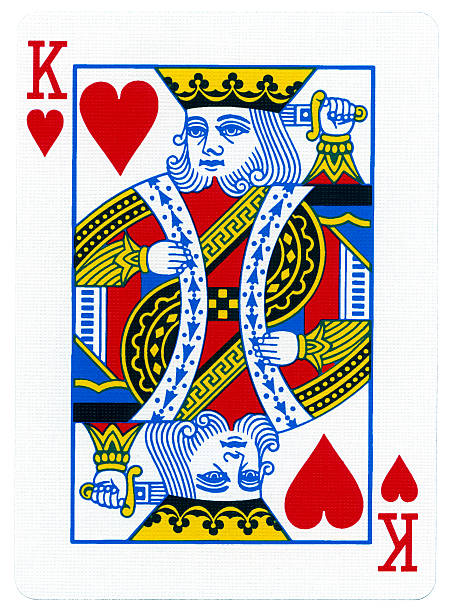

## Basic Probability {.build}

Probability represents how likely an event is to occur. The probability of an outcome can be measured as $$ P = \frac{\#\ Outcomes}{\#\ Trials}$$

To get a real measure of this, we have to observe an infinite number of ***trials***, which is impossible. 

Instead, we are stuck merely observing a ***sample*** of possible trials. 

We try to make this sample as representative as we can, but sometimes logistics and chance conspire to make a sample of trials unrepresentative. 

If the sample of trials is unrepresentative, then our estimate of probability may be badly wrong.  

## Sampling in R {.build}

There are functions that make it very easy to sample from vectors in R.

We can use the `sample()` function to draw a sample of 10 individuals from this population. 

Notice that when we do this twice, the samples are very rarely identical. 

```{r}
individuals <- 1:1000
sample(individuals, 10)
sample(individuals, 10)
```

## Quantifying probability {.build}

**Outcome** = what happens during a particular event

**Sample space** = the universe of possible outcomes.  

Outcomes should be ***exhaustive*** in describing the sample space and the outcomes should be ***mutually exclusive***. 

When these conditions are met, then the sum of probabilities for all outcomes in the sample space is 1.

## Complex events = composites of simple events (Logical OR) {.build}



sum the probabilities of simple events

e.g. probability of drawing a King from a deck of cards is the sum of the probability of drawing each of the 4 distinct kings 
  
  $$1/52 + 1/52 + 1/52 + 1/52 = 4/52 = 1/13 $$
  
  
## Shared events = multiple simultaneous occurrences of simple events (Logical AND)  {.build .columns-2}


multiply the probabilities of simple events

assume that events are ***independent*** of one another

e.g. probability of drawing the king of hearts is the probability of drawing a king multiplied by the probability of drawing a heart

$$ 1/4 * 1/13 = 1/52 $$

## Shared events- challenge

If you drew two cards from a standard deck, what is the probability of drawing the 2 of Clubs and the Jack of Spades together?


## Set operations  {.build .smaller}

The sample space can be described as a ***set*** of all possible outcomes.  

For example, if we flip a coin exactly 3 times and observe the results, then the set of possible outcomes is: 

$$ Tosses = \{(H, H, H), (H, H, T), (H, T, H), (H, T, T), (T, H, H), (T, H, T), (T, T, H), (T, T, T)\}$$

## intersection (shared events) {.build}

The intersection of two sets A and B represents the elements in common to both sets. 

The probability of the intersection of A and B represents the probability of the shared event A AND B. Assuming A and B are independent:

$$ P(A \cap B) = P(A) * P(B) $$ 


## union  (complex events) {.build}

The union of two sets A and B consists of all the shared elements of A and B. 

The probability of the union of two sets represents the probability of the complex event A OR B. 

To compute it we add the probabilities of A and B, and subtract the probability of the intersection between A and B, so as not to double count. 

$$ P(A \cup B) = P(A) + P(B) - P(A \cap B)$$


## Conditional Probability  {.build}

Sometimes probabilities in a complex event depend on previous outcomes.  To calculate the probability of A given B, we use the following formula. 

$$P(A|B) = \frac{P(A\cap B)}{P(B)}$$

## Conditional Probabilty is fundamental  {.build}

It forms the basis of frequentist statistics, as well as Bayesian statistcs, which we will talk about much more next week.
