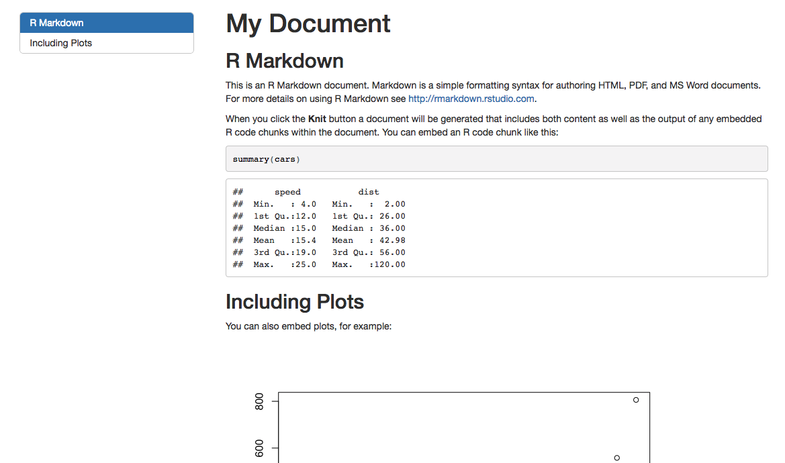

## Markdown issues {.build}

Many of you still are not using markdown effectively.

All of you are correctly putting R code into code blocks, otherwise your R code wouldn't run when you knit the file. 

But, some people are writing long responses as comments inside code chunks.

Many other people aren't using the formatting tools correctly outside the code chunks. 

Make sure you look at your knit file and make sure it is easy to read!

Show example

## Section headings {.build}

Pay careful attention to the way you use headings in Rmarkdown.  

*  `##` is the main section level heading
*  `###` is the sub-section level heading 
*  `####` is for the sub-sub-section level heading

The key point is, think about the structure of the document, and use the headings consistently. 

<span class="red2">These get used when you use a table of contents for your document.</span>

## Table of Contents {.smaller}

```{}
---
title: "My Document"
output: 
  html_document:
    toc: yes
    toc_float: yes
---
```




## pander 

#### a useful tool for formatting tabular data in R Markdown

By default when you print a dataframe to a markdown document, it doesn't look that great. 

```{r}
head(mtcars)
```

## better formatting {.smaller}

#### pander turns the dataframe into something much nicer!

```{r}
library(pander)
pander(mtcars, split.tables = 200)
```

## pander is smart 

#### deals with many common output types

So you can pass model objects, summaries, etc

## lm

```{r}
pander(lm(mpg~wt, data=mtcars))
```


## chisq.test

```{r}
pander(chisq.test(mtcars$cyl))
```

## anova

```{r}
pander(anova(lm(mpg~cyl, data=mtcars)))
```

## prcomp

```{r}
pander(summary(prcomp(mtcars)))
```


## Challenge

Create a new markdown document that has three sections.  Make sure your document has a table of contents. Knit it to be sure that it works. 

## Ask me three remaining questions you have about using R

 
